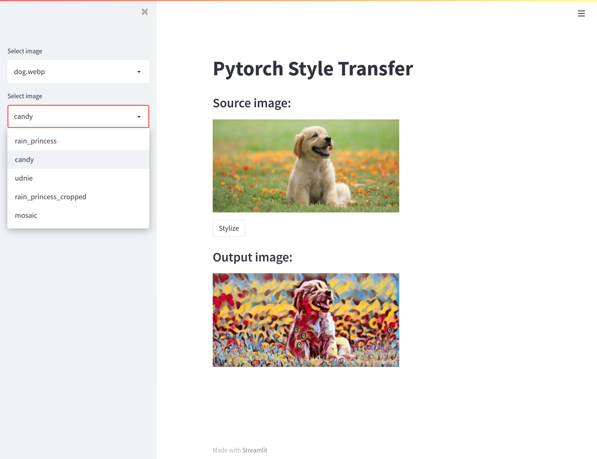

This is an experiment using transformer net to stylize images.

Images folder contains the pictures you can stylize. Saved_models folder contains the the models of styles you can choose from.

Start with:
```bash
streamlit run main.py
```
You should have something similar in your browser at http://localhost:8501


